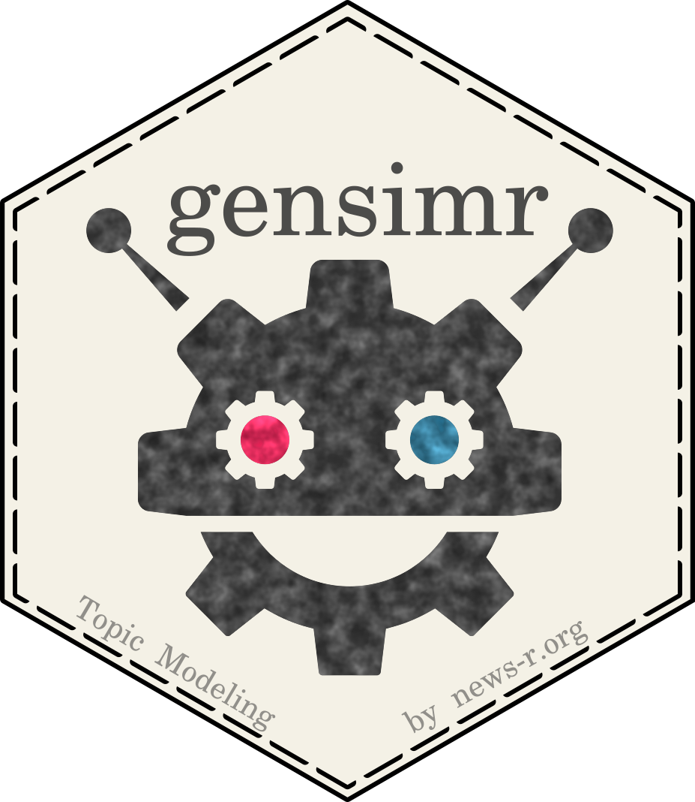

<!-- README.md is generated from README.Rmd. Please edit that file -->

<!-- badges: start -->

<!-- badges: end -->

# gensimr

Brings [gensim](https://radimrehurek.com/gensim) to R: efficient
large-scale topic
    modeling.

  - [Installation](https://gensimr.news-r.org/articles/installation.html)
  - [Preprocessing](https://gensimr.news-r.org/articles/preprocessing.html)
  - [Documentation](https://gensimr.news-r.org/)

⚠️ Notice the “Experimental” lifecycle badge: things won’t work, stuff
will break.
