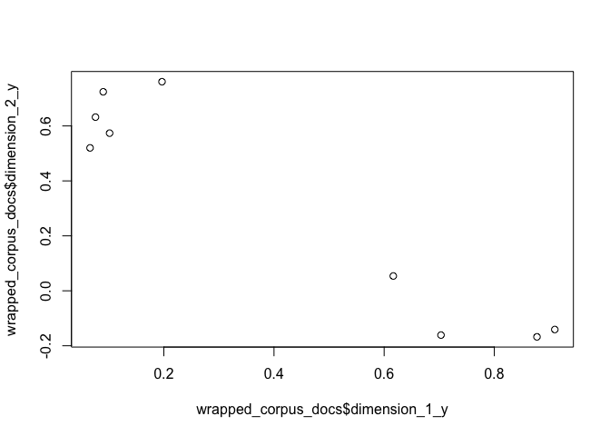
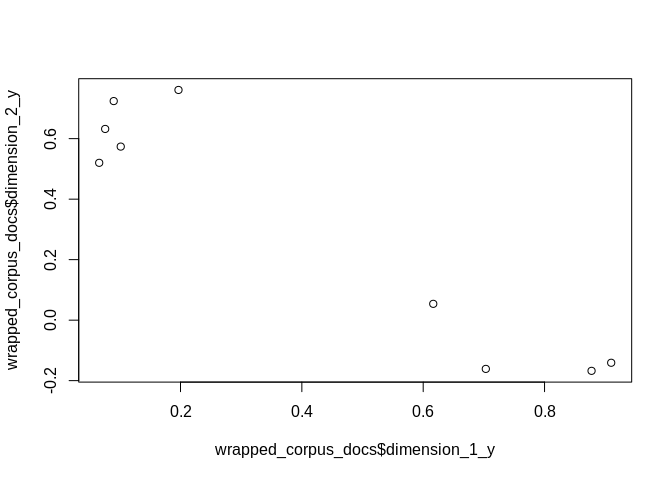
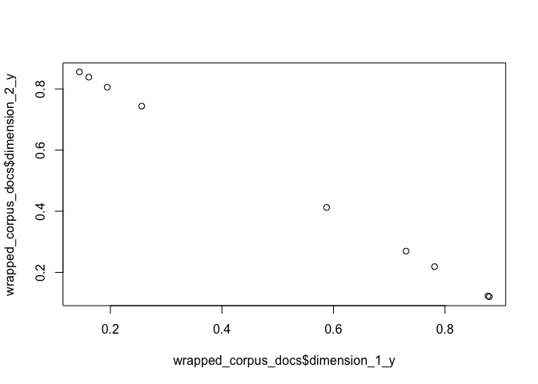

<!-- README.md is generated from README.Rmd. Please edit that file -->

<!-- badges: start -->

[](https://www.tidyverse.org/lifecycle/#experimental)
[](https://travis-ci.org/news-r/gensimr)
<!-- badges: end -->

# gensimr

Brings [gensim](https://radimrehurek.com/gensim) to R: efficient
large-scale topic modeling.

⚠️ Notice the “Experimental” lifecycle badge: things won’t work, stuff
will break.

## Installation

Install the package.

``` r
# install.packages("remotes")
remotes::install_github("news-r/gensimr")
```

Install the python dependency.

``` r
gensimr::install_gensim()
```

Ideally one should use a virtual environment and pass it to
`install_gensim`, only do this once.

``` r
# replace with path of your choice
my_env <- "./env"

# run this (works on unix)
args <- paste("-m venv", env)
system2("python3", args) # create environment
reticulate::use_virtualenv(my_env) # force reticulate to use env
gensimr::install_gensim(my_env) # install gensim in environment
```

## Topics

First we preprocess the corpus using example data, a tiny corpus of 9
documents.

``` r
library(gensimr)

data(corpus, package = "gensimr")

print(corpus)
#> [1] "Human machine interface for lab abc computer applications"    
#> [2] "A survey of user opinion of computer system response time"    
#> [3] "The EPS user interface management system"                     
#> [4] "System and human system engineering testing of EPS"           
#> [5] "Relation of user perceived response time to error measurement"
#> [6] "The generation of random binary unordered trees"              
#> [7] "The intersection graph of paths in trees"                     
#> [8] "Graph minors IV Widths of trees and well quasi ordering"      
#> [9] "Graph minors A survey"

docs <- preprocess(corpus)
#> → Preprocessing 9 documents
#> ← 9 documents after perprocessing
```

Once preprocessed we can build a dictionary.

``` r
dictionary <- corpora_dictionary(docs)
```

A dictionary essentially assigns an integer to each term.

`doc2bow` simply applies the method of the same name to every documents
(see example below); it counts the number of occurrences of each
distinct word, converts the word to its integer word id and returns the
result as a sparse vector.

``` r
# native method to a single document
dictionary$doc2bow(docs[[1]])
#> [(0, 1), (1, 1), (2, 1)]

# apply to all documents
corpus_bow <- doc2bow(dictionary, docs)
```

Then convert to matrix market format and serialise, the function returns
the path to the file (this is saved on disk for efficiency), if no path
is passed then a temp file is created.

``` r
(corpus_mm <- mmcorpus_serialize(corpus_bow))
#> ℹ Path: /var/folders/n9/ys9t1h091jq80g4hww24v8g0n7v578/T//RtmpzKfZQV/file18c12b31ecce.mm 
#>  ✔ Temp file
```

Then initialise a model, we’re going to use a Latent Similarity Indexing
method later on (`model_lsi`) which requires td-idf.

``` r
tfidf <- model_tfidf(corpus_mm)
```

We can then use the model to transform our original corpus.

``` r
corpus_transformed <- wrap(tfidf, corpus_bow)
```

Finally, we can build models, the number of topics of `model_*`
functions defautls to 2, which is too low for what we generally would do
with gensimr but works for the low number of documents we have.

### Latent Similarity Index

Note that we use the transformed corpus.

``` r
lsi <- model_lsi(corpus_transformed, id2word = dictionary)
#> ⚠ Low number of topics
lsi$print_topics()
#> [(0, '0.703*"trees" + 0.538*"graph" + 0.402*"minors" + 0.187*"survey" + 0.061*"system" + 0.060*"time" + 0.060*"response" + 0.058*"user" + 0.049*"computer" + 0.035*"interface"'), (1, '-0.460*"system" + -0.373*"user" + -0.332*"eps" + -0.328*"interface" + -0.320*"time" + -0.320*"response" + -0.293*"computer" + -0.280*"human" + -0.171*"survey" + 0.161*"trees"')]
```

We can then wrap the model around the corpus to extract further
information, below we extract how each document contribute to each
dimension (topic).

``` r
wrapped_corpus <- wrap(lsi, corpus_transformed)
(wrapped_corpus_docs <- get_docs_topics(wrapped_corpus))
#> # A tibble: 9 x 4
#>   dimension_1_x dimension_1_y dimension_2_x dimension_2_y
#>           <dbl>         <dbl>         <dbl>         <dbl>
#> 1             0        0.0660             1       -0.520 
#> 2             0        0.197              1       -0.761 
#> 3             0        0.0899             1       -0.724 
#> 4             0        0.0759             1       -0.632 
#> 5             0        0.102              1       -0.574 
#> 6             0        0.703              1        0.161 
#> 7             0        0.877              1        0.168 
#> 8             0        0.910              1        0.141 
#> 9             0        0.617              1       -0.0539
plot(wrapped_corpus_docs$dimension_1_y, wrapped_corpus_docs$dimension_2_y)
```



### Random Projections

Note that we use the transformed corpus.

``` r
rp <- model_rp(corpus_transformed, id2word = dictionary)
#> ⚠ Low number of topics

wrapped_corpus <- wrap(rp, corpus_transformed)
wrapped_corpus_docs <- get_docs_topics(wrapped_corpus)
plot(wrapped_corpus_docs$dimension_1_y, wrapped_corpus_docs$dimension_2_y)
```



### Latent Dirichlet Allocation

Note that we use the original, non-transformed corpus.

``` r
corpus_mm <- mmcorpus_serialize(corpus_bow)
lda <- model_lda(corpus_mm, id2word = dictionary)
#> ⚠ Low number of topics
lda_topics <- lda$get_document_topics(corpus_bow)
wrapped_corpus_docs <- get_docs_topics(lda_topics)
plot(wrapped_corpus_docs$dimension_1_y, wrapped_corpus_docs$dimension_2_y)
```



### Hierarchical Dirichlet Process

``` r
corpus_mm <- mmcorpus_serialize(corpus_bow)
hdp <- model_hdp(corpus_mm, id2word = dictionary)
reticulate::py_to_r(hdp$show_topic(topic_id = 1L, topn = 5L))
#> [[1]]
#> [[1]][[1]]
#> [1] "time"
#> 
#> [[1]][[2]]
#> [1] 0.1907375
#> 
#> 
#> [[2]]
#> [[2]][[1]]
#> [1] "human"
#> 
#> [[2]][[2]]
#> [1] 0.1676811
#> 
#> 
#> [[3]]
#> [[3]][[1]]
#> [1] "system"
#> 
#> [[3]][[2]]
#> [1] 0.1390491
#> 
#> 
#> [[4]]
#> [[4]][[1]]
#> [1] "user"
#> 
#> [[4]][[2]]
#> [1] 0.1309728
#> 
#> 
#> [[5]]
#> [[5]][[1]]
#> [1] "interface"
#> 
#> [[5]][[2]]
#> [1] 0.09493314
```

## Similarity

``` r
corpus_mm <- mmcorpus_serialize(corpus_bow)
mm <- read_serialized_mmcorpus(corpus_mm)

new_document <- "A human and computer interaction"
preprocessed_new_document <- preprocess(new_document, min_freq = 0)
#> → Preprocessing 1 documents
#> ← 1 documents after perprocessing
vec_bow <- doc2bow(dictionary, preprocessed_new_document)
vec_lsi <- wrap(lsi, vec_bow)

wrapped_lsi <- wrap(lsi, mm)
index <- similarity_matrix(wrapped_lsi)

sims <- wrap(index, vec_lsi)

get_similarity(sims)
#> # A tibble: 9 x 2
#>     doc  cosine
#>   <dbl>   <dbl>
#> 1     2  1.000 
#> 2     0  1.000 
#> 3     3  1.000 
#> 4     4  0.999 
#> 5     1  0.995 
#> 6     8  0.194 
#> 7     7 -0.0237
#> 8     6 -0.0516
#> 9     5 -0.0880
```
